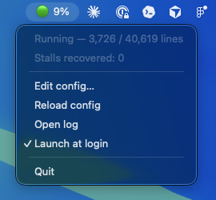

# CNCjs Watchdog

A macOS menu bar app that watches a CNCjs sender on `grbl.local` and auto-recovers
stalled jobs (Grbl sits Idle while CNCjs keeps "running"). It connects whenever the
Raspberry Pi is reachable, watches every job, recovers stalls by toggling the sender
pause/resume, and idles between jobs — so you never launch a script by hand.

<p align="center">
  
</p>

## Status dot
- ⚪ grey/white — disconnected (Pi off) or connected & idle
- 🟢 green — a job is running, being watched (title shows live `%` complete)
- 🟠 amber — recovering a stall

## Setup

You must give it your **CNCjs secret** — the `secret` value from your CNCjs config
(`~/.cncrc` or `~/.cncjs/cncrc.cfg` on the machine running CNCjs). It signs the auth
token used to connect. Put it (and any other overrides) in `~/.cncjs-watchdog.json`:

```json
{
  "host": "grbl.local",
  "serial_port": "/dev/ttyACM0",
  "secret": "your-cncjs-secret-here"
}
```

From the running app you can also use **Edit config…** (creates/opens this file,
pre-filled) and **Reload config** to apply changes live. Without a secret it will
connect but CNCjs will reject the token.

## Config fields
Defaults live in `cncwatch/config.py`; override any of them in `~/.cncjs-watchdog.json`:

| field | default | meaning |
|---|---|---|
| `host` / `port` | `grbl.local` / `8000` | CNCjs server |
| `serial_port` / `baud` | `/dev/ttyACM0` / `115200` | machine serial port |
| `controller_type` | `Grbl` | CNCjs controller type |
| `secret` | _(none)_ | CNCjs signing secret (**required**) |
| `stall_secs` | `5` | no-movement seconds (while running) before it's a stall |
| `hold_secs` | `2` | pause→resume gap during recovery |
| `confirm_secs` | `2` | wait for motion after resume before re-arming |

Enable **Launch at login** from the menu to start it with your Mac.

## Develop
    python3 -m venv venv && ./venv/bin/pip install -r requirements.txt
    ./venv/bin/python -m pytest          # run tests
    ./venv/bin/python run_app.py         # run in dev

## Build the app
    ./venv/bin/python setup.py py2app
    open "dist/CNCjs Watchdog.app"

The bundle is menu-bar-only (no Dock icon) and self-contained. It's unsigned, so on
another Mac you may need to right-click → Open once (Gatekeeper).

## License
MIT — see [LICENSE](LICENSE).
